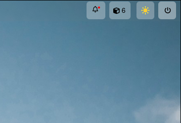
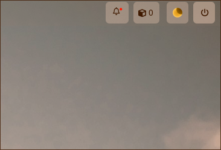

# hyprsunset-overdrive

A simple program to enable/disable the blue light filter on Hyprland based on sunrise and sunset in Nairobi, Kenya.





## Requirements

- `Hyprland`
- `hyprsunset`

## Building

To build the program, you will need the Rust toolchain installed.

```bash
cargo build --release
```

Move the executable to a bin folder in your path.

```bash
mv target/release/hyprsunset-overdrive ~/.local/bin
```

## Usage

Add the following to your Hyprland config file:

```
exec-once = ~/.local/bin/hyprsunset-overdrive
```

### Configuration

You can configure the program by editing it's config file found in `~/.config/hypr/hyprsunset-overdrive.toml`. The default config is as follows:

```toml
temperature = 3000
# Coordinates for Nairobi, Kenya
latitude = -1.2921
longitude = 36.8219
# Altitude of Nairobi, Kenya in meters. You can set it as 0.
altitude = 1795
```

The `temperature` option sets the color temperature of the blue light filter. The `latitude` and `longitude` options set the location of the sunrise and sunset calculations.

The program will automatically enable the blue light filter when the sun is above the horizon and disable it when the sun is below the horizon.

## Acknowledgments

This tool borrows some implementations from [sunsetr](https://github.com/psi4j/sunsetr). **sunsetr** is a great tool, as you can manually set the start and end times for the blue light filter.
